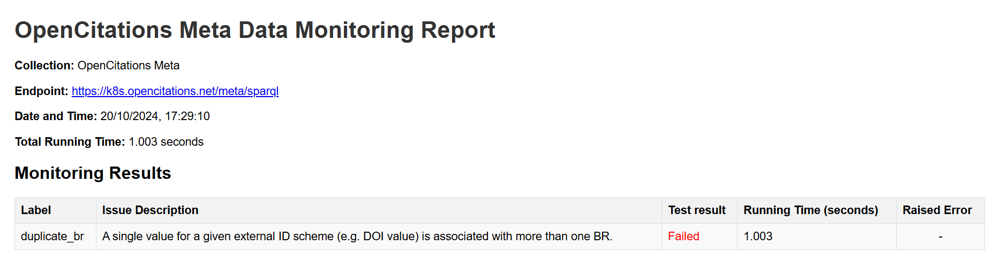

# SPARQL Data Quality Monitoring Tool

This software provides tools to monitor the quality of data in OpenCitation Meta and OpenCitations Index by querying their SPARQL endpoints. It includes two monitoring classes: **MetaMonitor** and **IndexMonitor**, which are designed to run a series of tests on the triplestores and generate reports on data quality issues.

The reports are generated in JSON format, which is then converted to HTML for easier visualization. <!-- The tool supports customizable configurations via command-line arguments for flexibility. -->

## Table of Contents

- [SPARQL Data Quality Monitoring Tool](#sparql-data-quality-monitoring-tool)
  - [Table of Contents](#table-of-contents)
  - [Overview](#overview)
  - [Installation](#installation)
  - [Usage](#usage)
    - [Configuration Files](#configuration-files)
    - [Command-Line Arguments](#command-line-arguments)
    - [Examples](#examples)
      - [Run Both MetaMonitor and IndexMonitor (Default)](#run-both-metamonitor-and-indexmonitor-default)
      - [Run Only MetaMonitor](#run-only-metamonitor)
      - [Custom Output Path](#custom-output-path)
      - [Run Only IndexMonitor with Custom Paths](#run-only-indexmonitor-with-custom-paths)
  - [Output Structure](#output-structure)
  - [Filename Details](#filename-details)
  - [License](#license)

## Overview

The tool uses SPARQL queries to check for potential issues in the data stored in the specified SPARQL endpoints:

- **MetaMonitor** is used for the **OpenCitations Meta** endpoint.
- **IndexMonitor** is used for the **OpenCitations Index** endpoint.

Each monitor runs a series of pre-configured tests defined in the related configuration file (in JSON format). The tests produce a report (JSON file) that details which issues are detected, including metadata such as runtime, whether the tests passed or failed, and any errors encountered during the process. The JSON report is then converted into HTML to be read more easily.

Two classes are responsible for interrogating the triplestores, the `MetaMonitor` class for OpenCitations Meta and the `IndexMonitor` class for OpenCitations Index, which can both be found inside the `data_monitor` module. They both require, upon instantiation, the path to the appropriate configuration file and the base path for the output files. In both the classes, the `run_tests()` method actually interrogates the endpoint specified in the related config file and produces the JSON output.

The JSON output can be converted into an HTML page by using the `generate_html()` method of the `ReportVisualiser` class, inside the `html_vis` module.

## Installation

1. **Clone the repository**:

    ```bash
    git clone https://github.com/opencitations/oc_monitor.git
    ```

2. **Install dependencies**:

    The project's dependencies and virtual environment are managed with [Poetry](https://python-poetry.org/docs/). If you're already using Poetry and have installed on your machine, you can use it to create a virtual enviroment by simply running:

    ```bash
    poetry install
    ```

    and then, to activate it:

    ```bash
    poetry shell
    ```
    If you're not using Poetry, you can install the required Python libraries by using `pip` and the requirements.txt file on your preferred environment:

    ```bash
    pip install -r requirements.txt
    ```

3. **Ensure proper configuration files**:

   Make sure you have the necessary configuration files (e.g., `meta_monitor_config.json` and `index_monitor_config.json`) in the project folder. See the section on [Configuration Files](#configuration-files) for details. The configuration files provided in this repository should work out of the box.

## Usage

To run the process with the default configuration from within the `monitor` directory:

```bash
python -m main
```

### Configuration Files

The configuration files for both MetaMonitor and IndexMonitor are in JSON format and contain details about the endpoint to be queried and the tests to run. The `endpoint` field stores the URL of the endpoint to interrogate. The fields for each test include:

- `label`: A short name for the tested issue.
- `description`: A brief description of the issue.
- `query`: The SPARQL query used to perform the check.
- `to_run`: A boolean flag (true or false) indicating whether to run this specific test.

Example configuration (custom_meta_monitor_config.json):

```json
{
    "endpoint": "https://k8s.opencitations.net/meta/sparql",
    "tests": [
        {
            "label": "duplicate_br",
            "to_run": true,
            "description": "A single value for a given external ID scheme (e.g. DOI value) is associated with more than one BR.",
            "query": "PREFIX datacite: <http://purl.org/spar/datacite/>\nPREFIX literal: <http://www.essepuntato.it/2010/06/literalreification/>\nPREFIX fabio: <http://purl.org/spar/fabio/>\n\nASK {\n    ?br1 datacite:hasIdentifier/literal:hasLiteralValue ?lit ;\n    a fabio:Expression .\n    ?br2 datacite:hasIdentifier/literal:hasLiteralValue ?lit ;\n    a fabio:Expression .\n    FILTER(?br1 != ?br2)\n}"
        }
    ]
}
        
```

### Command-Line Arguments

The script allows users to further customise the default behaviour of the software via command-line arguments. Here are the available options:

| Argument               | Description                                                                                                      | Default Value                          |
|------------------------|------------------------------------------------------------------------------------------------------------------|----------------------------------------|
| `--meta_config`         | Filepath for the MetaMonitor configuration file.                                                                 | `meta_monitor_config.json`             |
| `--index_config`        | Filepath for the IndexMonitor configuration file.                                                                | `index_monitor_config.json`            |
| `--run`                | Specify which monitor to run: `meta`, `index`, or `both`.                                                         | `both`                                 |
| `--output_base_path`    | Base folder for reports output. The folder structure follows `monitor_results/<meta_reports\|index_reports>/<YYYYMMDD>/`.  | `monitor_results`                              |

### Examples

#### Run Both MetaMonitor and IndexMonitor (Default)

To run both monitors using default configurations and output paths:

```bash
python -m main
```

This will generate reports in:

- `results/meta_reports/YYYYMMDD/`
- `results/index_reports/YYYYMMDD/`

#### Run Only MetaMonitor

To run only the MetaMonitor and specify a custom configuration file:

```bash
python -m main --run meta --meta_config my_meta_config.json
```

#### Custom Output Path

To run both monitors but specify a custom output base path:

```bash
python -m main --output_base_path /my/custom/path
```

The reports will be saved in:

- `/my/custom/path/meta_reports/YYYYMMDD/`
- `/my/custom/path/index_reports/YYYYMMDD/`

#### Run Only IndexMonitor with Custom Paths

To run only the IndexMonitor and specify both the configuration file and a custom output path:

```bash
python -m main --run index --index_config custom_index_config.json --output_base_path custom_reports
```

The reports will be saved in `custom_reports/index_reports/YYYYMMDD/`.

## Output Structure

The output reports are stored in a folder structure that follows this pattern:

```bash
monitor_results/
  ├── meta_reports/
  │    └── YYYYMMDD/
  │         ├── output_meta_monitor_YYYYMMDD.json
  │         └── meta_monitor_vis_YYYYMMDD.html
  └── index_reports/
       └── YYYYMMDD/
            ├── output_index_monitor_YYYYMMDD.json
            └── index_monitor_vis_YYYYMMDD.html
```

The JSON output file stores information about the tests results along with details on the execution process (associated configuration file, date and time of the execution, runtime, raised errors, etc.). Each test result in the output file is associated with the label and description of the issue and the SPARQL query that has been run for the test itself.

Example JSON output (output_meta_monitor_20241020.json):

```json
{
    "endpoint": "https://k8s.opencitations.net/meta/sparql",
    "collection": "OpenCitations Meta",
    "datetime": "20/10/2024, 17:29:10",
    "running_time": 1.0028636455535889,
    "config_fp": "custom_meta_monitor_config.json",
    "monitoring_results": [
        {
            "label": "duplicate_br",
            "description": "A single value for a given external ID scheme (e.g. DOI value) is associated with more than one BR.",
            "query": "query": "PREFIX datacite: <http://purl.org/spar/datacite/>\nPREFIX literal: <http://www.essepuntato.it/2010/06/literalreification/>\nPREFIX fabio: <http://purl.org/spar/fabio/>\n\nASK {\n    ?br1 datacite:hasIdentifier/literal:hasLiteralValue ?lit ;\n    a fabio:Expression .\n    ?br2 datacite:hasIdentifier/literal:hasLiteralValue ?lit ;\n    a fabio:Expression .\n    FILTER(?br1 != ?br2)\n}"
            "run": {
                "got_result": true,
                "running_time": 1.0028636455535889,
                "error": null
            },
            "passed": false
        }
    ]
}
```

The above JSON report is then converted into an HTML document (although some information is left out, e.g. the SPARQL query for each test) and stored in the same directory:



## Filename Details

- JSON report: `output_<monitor_type>_YYYYMMDD.json`
- HTML report: `<monitor_type>_monitor_vis_YYYYMMDD.html`

If the script is run multiple times on the same day, the filenames of the files created after the first one will be versioned (e.g., `output_meta_monitor_YYYYMMDD_1.json`, `meta_monitor_vis_YYYYMMDD_1.html`, etc.).

## License

This project is licensed under the ISC License. See the [LICENSE.md](LICENSE.md) file for details.
